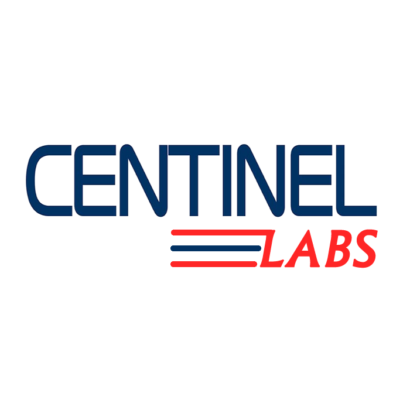

# Space Travelers' Hub
In this task, we will be working with the real live data from the SpaceX API. our task is to build a web application for a company that provides commercial and scientific space travel services. The application will allow users to book rockets and join selected space missions.

<a name="readme-top"> </a>

<div align="center">

  
  <br/>

  <h3><b>README</b></h3>

</div>

<!-- TABLE OF CONTENTS -->

# 📗 Table of Contents

- [📖 About the Project](#about-project)
  - [🛠 Built With](#built-with)
    - [Tech Stack](#tech-stack)
    - [Key Features](#key-features)
  - [🚀 Live Demo](#live-demo)
- [💻 Getting Started](#getting-started)
  - [Setup](#setup)
  - [Prerequisites](#prerequisites)
  - [Install](#install)
  - [Usage](#usage)
  - [Run tests](#run-tests)
  - [Deployment](#triangular_flag_on_post-deployment)
- [👥 Authors](#authors)
- [🔭 Future Features](#future-features)
- [🤝 Contributing](#contributing)
- [⭐️ Show your support](#support)
- [🙏 Acknowledgements](#acknowledgements)
- [❓ FAQ](#faq)
- [📝 License](#license)

<!-- PROJECT DESCRIPTION -->

# 📖 [Space Travelers' Hub] <a name="about-project"></a>

> Description.

**[Space Travelers' Hub]** In this task, we will be working with the real live data from the SpaceX API. our task is to build a web application for a company that provides commercial and scientific space travel services. The application will allow users to book rockets and join selected space missions.

## 🛠 Built With <a name="built-with"></a>

### Tech Stack <a name="tech-stack"></a>

>  React.js, Node.js

<details>
  <summary>Client</summary>
  <ul>
    <li><a href="https://reactjs.org/">React.js</a></li>
  </ul>
</details>

<!-- Features -->

### Key Features <a name="key-features"></a>

> Description
- **[Rockets /Dragons]**
- **[Missions]**
- **[My Profile]**

<p align="right">(<a href="#readme-top">back to top</a>)</p>

<!-- LIVE DEMO -->

## 🚀 Live Demo <a name="live-demo"></a>

> Add a link to your deployed project.

- [Live Demo Link](https://#)

<p align="right">(<a href="#readme-top">back to top</a>)</p>

<!-- GETTING STARTED -->

## 💻 Getting Started <a name="getting-started"></a>

> How a you could make use of this project.

To get a local copy up and running, follow these steps.

### Prerequisites

In order to run this project you need these, incase they are not already setup, Kindly Read [Prerequisites](./Prerequisites.md).

### Setup

Clone this repository to your desired folder:
```sh
  mkdir my-folder
  cd my-folder
  git clone git@github.com:SSEKPIUS/Microverse-React-Template--quick.git 
```

### Install

Install this project with:
```sh
  npm install -force
```

### Usage

To run the project, execute the following command:

Example command:

```sh
  npm run start
```

### Run tests

To run tests, run the following command:

Example command:

```sh
  npm test
```

### Deployment

You can deploy this project using:

<!--
Example:

```sh

```
 -->

<p align="right">(<a href="#readme-top">back to top</a>)</p>

<!-- AUTHORS -->

## 👥 Authors <a name="authors"></a>

> collaborators of this project.

👤 **Author 1**

1. Ssekweyama Pius

- GitHub: [@githubhandle](https://github.com/SSEKPIUS)

2. Gulalai Ahmadi

- GitHub: [@githubhandle](https://github.com/AhmadiGu)

3. Christian Kiyong

- GitHub: [@githubhandle](https://github.com/krisbobo)


<p align="right">(<a href="#readme-top">back to top</a>)</p>

<!-- FUTURE FEATURES -->

## 🔭 Future Features <a name="future-features"></a>

> features you will add to the project.

- [ ] **[Enhance the My Profile section]**
- [ ] **[Enhance the My Profile section by adding the "Cancel reservation" and "Leave Mission"]**
- [ ] **[Enhance the My Profile section by adding the "Read more"]**

<p align="right">(<a href="#readme-top">back to top</a>)</p>

<!-- CONTRIBUTING -->

## 🤝 Contributing <a name="contributing"></a>

Contributions, issues, and feature requests are welcome!

Feel free to check the [issues page](../../issues/).

<p align="right">(<a href="#readme-top">back to top</a>)</p>

<!-- SUPPORT -->

## ⭐️ Show your support <a name="support"></a>

> We encourage you to support this project

If you like this project, kindly donate a token at [Paypal]()

<p align="right">(<a href="#readme-top">back to top</a>)</p>

<!-- ACKNOWLEDGEMENTS -->

## 🙏 Acknowledgments <a name="acknowledgements"></a>

> Credit to everyone who inspired this codebase.

I would like to thank microverse student team for the resorces availed.

<p align="right">(<a href="#readme-top">back to top</a>)</p>

<!-- FAQ (optional) -->

## ❓ FAQ <a name="faq"></a>

> Questions new developers would ask when they decide to use this project.

- **What is front-end, HTML, CSS and JavaScript**
  - The front end refers to the parts of the application that users (also known as "clients") interact with directly
  - As a front-end dev, you'll implement these tasks primarily using HTML to define the structure of web pages, CSS to add styling, and JavaScript to add interactivity.

- **What is back-end and Full stack**
  - The back end refers to the parts of the application that run behind the scenes and aren't presented directly to the user/client.
  - The back end typically includes a web server which handles HTTP connections received from the front-end client (usually a web browser)
  - Full stack simply includes both the front end AND back end!

<p align="right">(<a href="#readme-top">back to top</a>)</p>

<!-- LICENSE -->

## 📝 License <a name="license"></a>

This project is [MIT](./LICENSE) licensed.

_NOTE: we recommend using the [MIT license](https://choosealicense.com/licenses/mit/) - you can set it up quickly by [using templates available on GitHub](https://docs.github.com/en/communities/setting-up-your-project-for-healthy-contributions/adding-a-license-to-a-repository). You can also use [any other license](https://choosealicense.com/licenses/) if you wish._

<p align="right">(<a href="#readme-top">back to top</a>)</p>